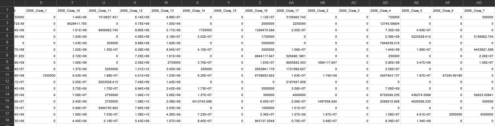
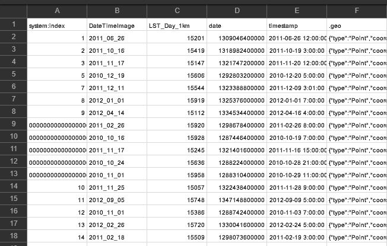

# Zonal-Statistics
Google Earth Engine(GEE) is an open-source platform for geospatial data analysis and its fast computation. We all know how tedious it is to download each satellite data tile and then curate it according to our need for further analysis. Even their analysis might need a high-end system with fast computing software if we are dealing with time-series data. All this could be done in just a few minutes and very little coding on GEE. Geospatial data computation on GEE not only saves time and storage but also provides flexibility. They have open-source [data catalog](https://developers.google.com/earth-engine/datasets/) including `Landsat` datasets, `Sentinel` datasets, `MODIS` Datasets, `NAIP` data, precipitation data, sea surface temperature data, `CHIRPS` climate data, and elevation data. You can check out this paper to know more about the GEE platform. - [Google Earth Engine: Planetary-scale geospatial analysis for everyone](https://www.sciencedirect.com/science/article/pii/S0034425717302900)

There are different types of spatial-temporal analysis with their respective real-world application. With the help of a wide variety of satellite data collected since the start of the Landsat series in 1972, one can compute various indices across both space and time. This repository will cover most of the zonal computation along with its example in a real-world implementation. It results in creating a `Comma delimited table` for each analysis until mentioned otherwise.

## Installing
```bash
git clone https://github.com/saumyatas/Zonal-Statistics.git
```

## Contents[^note]
[^note]: You can provide your suggestion with any other examples of zonal statistics. I will update this repository with new examples in time.
1. [Extract NDVI using MODIS data at each GPS points.](#1-extract-ndvi-using-modis-data-at-each-gps-points)  
2. [Extracting mean vegetation index for each year.](#2-extracting-mean-vegetation-index-for-each-year)
3. [Extract area for each LULC class using MODIS Yearly Global data.](#3-extract-area-for-each-lulc-class-using-modis-yearly-global-data)
4. [Extracting Land Surface Temperature at each GPS points.](#4-extracting-land-surface-temperature-at-each-gps-points)

### 1. Extract NDVI using MODIS data at each GPS points.
We often conduct ground survey to analyse the land use of our study area. As one of the example, I have witnessed that we require land use of animal camera trap points collected over the period of time, in order to anlyze their migration pattern and movement analysis. This example is inspired from [Enhancing Animal Movement Analyses: Spatiotemporal Matching of Animal Positions with Remotely Sensed Data Using Google Earth Engine and R](https://www.mdpi.com/2072-4292/13/20/4154) paper. They have analyzed vegetation index and temperature index using MODIS and ERA5 data respectively on R. `MODIS` dataset have 250 meter spatial and 16 days temporal resolution (16 days time interval between the acquisition of 2 continuous images), thus we can use this for closely spaced points. But as per for the temperature index, as ERA5-Land Hourly data have 11132 meter as spatial resolution, so I will use other methods to extract it. For this particular example I have used their open source [data](https://github.com/Smithsonian/SpatiotemporalMatchingOfAnimalPositionsWithRemotelySensedDataUsingGoogleEarthEngineAndR/blob/main/Data/Data.csv). 

While analyzing my country data, the problem I have faced that each country have their respective timestamp format, so remember to change it before extracting pixel value.
`ee.Date.parse('YYYY-MM-dd', datefeat)`, where datefeat is the date feature, is used to convert it to the required format. My data was in `MM-dd-YYYY` format, so know your data before analyzing it. The gap between date-time of GPS points and raster image date to extract NDVI is not more than 16 days. As this code extract the value from the nearest date MODIS dataset. 

The resultant CSV file for the [GEE code](1_MODIS_NDVI/MODIS_NDVI_GEE.js) will be like this:


### 2. Extracting mean vegetation index for each year.
This example shows how one can create a database file with zonal statistics of the Vegetation index for their study area for the range of years. That database file can later be analyzed for various applications. Lets say, if you have a polygon file (Geospatial vector file) and you need to analyze its vegetation pattern for the range of consecutive years, you can choose either of the vegetation index, commonly used NDVI (Normalized Difference Vegetation Index) index or EVI (Enhanced Vegetation Index). Google Earth Engine provides range of MODIS data products including [Terra Vegetation Indices for 16-days Global (250m, 500m or 1km)](https://developers.google.com/earth-engine/datasets/catalog/MODIS_006_MOD13Q1). In order to extract vegetation index, user can select NDVI and EVI index from these MODIS Products. I am using districts of Maharashtra as my study area but one can use feature collection or polygons shapefile. In order to add your shapefile on GEE platform, kindly refer to [Importing Table Data](https://developers.google.com/earth-engine/guides/table_upload?hl=en), it is as simple as adding a raster or vector file on QGIS or ArcGIS softwares.

The resultant CSV file for the [GEE code](2_Zonal_EVI/Zonal_EVI_GEE.js) will be like this:


### 3. Extract area for each LULC class using MODIS Yearly Global data.
The dataset  used for this example is [MCD12Q1.006 MODIS Land Cover Type Yearly Global](https://developers.google.com/earth-engine/datasets/catalog/MODIS_006_MCD12Q1?hl=en#bands). It covers 500 meter spatial resolution and derived from six different classification schemes. I will extract the area covered by each class in our study area from land cover class type-1 according to this dataset. There are total of 17 classes in this type of land cover type covering different types of forest, buitup area, barren land types and water bodies. I am using districts of Maharashtra as my study area but one can use feature collection or polygons shapefile. In order to add your shapefile on GEE platform, kindly refer to [Importing Table Data](https://developers.google.com/earth-engine/guides/table_upload?hl=en), it is as simple as adding a raster or vector file on QGIS or ArcGIS softwares.

The resultant CSV file for the [GEE code](3_LULC_zonal/3_LULC_zonal_proportional.js) will be like this:


### 4. Extracting Land Surface Temperature at each GPS points.
The ground surveys are conducted to analyze the movement of wildlife, which are generally carried out on a 1km x 1km grid. And in order to understand the behavior of animals movement, different environmental parameters are extracted from the time series satellite dataset. This example shows how users can extract Land Surface Temperature (LST) at 1 km spatial resolution using [MOD11A2.006 Terra Land Surface Temperature and Emissivity 8-Day Global 1km](https://developers.google.com/earth-engine/datasets/catalog/MODIS_006_MOD11A2) dataset. I have used an open source [data](https://github.com/Smithsonian/SpatiotemporalMatchingOfAnimalPositionsWithRemotelySensedDataUsingGoogleEarthEngineAndR/blob/main/Data/Data.csv). 

The resultant CSV file for the [GEE code](4_MODIS_LST/4_MODIS_LST_GEE.js) will be like this:


## Author
[Saumyata Srivastava](https://www.linkedin.com/in/ss-97b05a103/)

[](https://github.com/saumyatas)
[](mailto:saumyata.srivastava@gmail.com)
[](https://www.linkedin.com/in/ss-97b05a103/)
[](https://www.kaggle.com/saumyatas1202)
[](https://medium.com/@srivastava.saumyata)

## License
This project is licensed under the MIT License - see the [LICENSE](LICENSE) file for details

